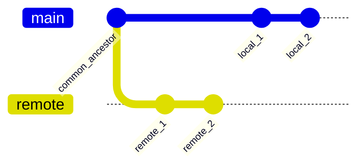

# Git Divergence Audit Skill (v1)

This skill provides a high-fidelity protocol for auditing divergence between two Git branches (e.g., `main` and `origin/main`). It ensures that every unique technical asset, metadata change, and historical gap is accounted for before any reconciliation (REBASE/MERGE) occurs.

***

## 1. Environment & Dependencies

Before execution, the agent **MUST** verify the industrial environment.

1. **Verify Git**:
   ```powershell
   git --version
   ```
2. **Verify PowerShell**:
   ```powershell
   $PSVersionTable.PSVersion
   ```
3. **Verify Git PAGER**:
   Set `PAGER=cat` and `GIT_PAGER=cat` for the audit session to prevent terminal hangs:
   ```powershell
   $env:PAGER = 'cat'
   $env:GIT_PAGER = 'cat'
   ```

### 1.1 PowerShell Mandate (Hard Rule)

This skill is **PowerShell-first**. Every command, including read-only one-liners (e.g., `git rev-parse`,
`git merge-base`), MUST be invoked from PowerShell. Inline `bash`/`sh`/`zsh` shortcuts are **forbidden**, even on
macOS/Linux. If a command needs ad-hoc composition, write it into a `.ps1` file and invoke that file.

This requirement, plus quoting/escape correctness and profile initialization, is governed by
[`script-management-rules.md`](../../../ai-agent-rules/script-management-rules.md):

- **Escape sequences inside single quotes are not expanded.** Use double quotes (`"..."`) whenever a string
  contains `` `t ``, `` `n ``, `` `r ``, `$var`, or `$($expr)`. After generating any script, scan for
  backtick-escapes inside single quotes and convert those strings to double quotes.
- **Profile initialization is mandatory.** Always invoke `pwsh-preview -File <script>.ps1` (or `pwsh -File ...`
  as fallback). The `-NoProfile` / `-nop` flags are **forbidden** unless a CI/CD environment explicitly requires
  a deterministic shell with no user-side state and the requirement is documented inline.

***

## 2. Divergence Discovery

Identify the relationship between the local HEAD and the remote source of truth.

### 2.1 Manual one-shot (PowerShell only)

```powershell
$Local  = git rev-parse <local_branch>
$Remote = git rev-parse <remote_branch>
$Base   = git merge-base <local_branch> <remote_branch>
Write-Host "local  : $Local"
Write-Host "remote : $Remote"
Write-Host "base   : $Base"

# Ahead / Behind counts (tab-separated: <ahead>`t<behind>)
git rev-list --left-right --count "<local_branch>...<remote_branch>"
```

### 2.2 Enumerate unique commits per side (mandatory)

After ahead/behind counts, list the actual commits on each side. This is required for the CAM (§3.2) and for
distinguishing a rewrite-mirror from true parallel work.

```powershell
Write-Host "=== Local <local_branch> ahead (unique to local) ==="
git log --oneline "<remote_branch>..<local_branch>"

Write-Host "=== Remote <remote_branch> ahead (unique to remote) ==="
git log --oneline "<local_branch>..<remote_branch>"
```

> The `A..B` syntax means "reachable from B but not from A" — i.e. commits that exist only on side B. Always run
> **both** directions; running only one hides parallel work on the other side.

### 2.3 Disjoint history detection (no common ancestor)

If `git merge-base <local> <remote>` prints nothing (and exits non-zero), the two branches share **no common
ancestor**. Their root commits differ. This is common after `git filter-repo` rewrites every blob — the new graph
has zero SHA overlap with the canonical history.

```powershell
Write-Host "=== merge-base (raw + exit code) ==="
$Base = git merge-base <local_branch> <remote_branch> 2>&1
$ExitCode = $LASTEXITCODE
Write-Host ("merge-base output    : '" + $Base + "'")
Write-Host ("merge-base exit code : " + $ExitCode)

if ($ExitCode -ne 0 -or [string]::IsNullOrWhiteSpace($Base)) {
    Write-Host "DISJOINT HISTORIES — no common ancestor" -ForegroundColor Red

    Write-Host "=== root commits of each branch ==="
    Write-Host ("local  root: " + (git rev-list --max-parents=0 <local_branch>))
    Write-Host ("remote root: " + (git rev-list --max-parents=0 <remote_branch>))

    Write-Host "=== tip-tip ancestry (both directions) ==="
    git merge-base --is-ancestor <local_branch>  <remote_branch> 2>&1 | Out-Null
    Write-Host ("local  ancestor-of remote? exit=" + $LASTEXITCODE + " (0=yes)")
    git merge-base --is-ancestor <remote_branch> <local_branch>  2>&1 | Out-Null
    Write-Host ("remote ancestor-of local?  exit=" + $LASTEXITCODE + " (0=yes)")

    Write-Host "=== root-walk (last N commits = oldest commits on each branch) ==="
    Write-Host "--- local root-walk (oldest 5) ---"
    git log --oneline <local_branch>  | Select-Object -Last 5
    Write-Host "--- remote root-walk (oldest 5) ---"
    git log --oneline <remote_branch> | Select-Object -Last 5
}
```

#### What each check tells you

| Output | Meaning |
|---|---|
| `merge-base` empty + exit 1 | Confirmed disjoint histories |
| Different root commits | Confirms the rewrite reached commit #1 (or branches were initialized independently) |
| Both `--is-ancestor` checks return non-zero | Neither side is reachable from the other — true graph divergence |
| Root-walk shows identical subjects in identical order | **Suspected rewrite mirror** despite zero SHA overlap — confirm via the equivalence-check primitive (see below) before force-push |
| Root-walk shows different subjects/order | True parallel work on disjoint roots — requires cherry-pick reconciliation |

#### Per-commit content-equivalence determination (delegated)

This skill **does NOT duplicate** the patch-id / tree-SHA / tree-diff / subject-body logic that proves whether two
diverged commits are content-equivalent. That responsibility lives in the
[`git-commit-comparison-audit`](../git-commit-comparison-audit/SKILL.md) skill, specifically its **§2.2 Content
Equivalence Check** primitive (`equivalence-check.ps1`). Invoke it pairwise across the aligned commit list (e.g.,
local root vs. remote root, then walk forward) to confirm the mirror hypothesis before authorizing a force-push:

```powershell
pwsh-preview -File .agents/skills/git-commit-comparison-audit/scripts/equivalence-check.ps1 `
    -Sha1 <local_sha> -Sha2 <remote_sha>
```

For full side-by-side metadata + reachability + submodule depth on a single pair, invoke the orchestrator:

```bash
python3 .agents/skills/git-commit-comparison-audit/scripts/compare.py <local_sha> <remote_sha>
```

> `A..B` and `git rev-list --left-right` still work numerically on disjoint histories (they treat the missing
> ancestor as the empty set), but the resulting "ahead/behind" counts are misleading — they equal the full
> length of each branch. Always pair the count with §2.3 ancestry checks before interpreting.

### 2.4 Automated audit (preferred)

Use the bundled industrial audit script — it covers ahead/behind, unique commits per side, asset categorization,
and CAM-table generation in one invocation:

```powershell
pwsh-preview -File .agents/skills/git-divergence-audit/scripts/audit.ps1 `
  -LocalBranch  "<local_branch>"  `
  -RemoteBranch "<remote_branch>" `
  -Markdown
```

Fallback when `pwsh-preview` is unavailable:

```powershell
pwsh -File .agents/skills/git-divergence-audit/scripts/audit.ps1 -LocalBranch "<local_branch>" -RemoteBranch "<remote_branch>" -Markdown
```

> **Do not pass `-NoProfile`.** See §1.1.

### 2.5 Interpreting the result

| Pattern | Meaning |
|---|---|
| ahead=0, behind=0 | Identical tips — no audit needed |
| ahead=N, behind=0 | Local is strict superset; safe fast-forward push possible |
| ahead=0, behind=N | Remote is strict superset; safe fast-forward pull possible |
| ahead=N, behind=N (same N, identical subjects) | **Rewrite mirror** — local was history-rewritten from the same canonical tip; force-push (`--force-with-lease`) is the resolution after equivalence audit |
| ahead=N, behind=M (different subjects) | True parallel work — requires per-commit CAM and rebase/merge plan |
| `merge-base` empty / non-zero exit | **Disjoint histories — no common ancestor.** See §2.3. Reconciliation requires explicit cross-history strategy (cherry-pick or `--allow-unrelated-histories`). |

***

## 3. Asset Auditing (Unit-by-Unit)

Perform a surgical audit of the technical assets changed in the divergent gap.

### 3.1 Categorization Matrix
Every change must be assigned to one of these industrial categories:
- **Technical Asset**: Skills (`.agents/skills/`), scripts, rules (`ai-agent-rules/`), core logic changes.
- **Documentation**: README, AGENTS.md, docs/.
- **Metadata/Noise**: IDE configs (`.vscode/`), placeholder updates, whitespace.

### 3.2 Commit Action Mapping (CAM)
Generate a table of proposed actions for the reconciliation phase:

| Commit Hash | Author | Category | Proposed Action (KEEP/DROP/SQUASH/REWORD) | Rationale |
| :--- | :--- | :--- | :--- | :--- |
| `[HASH]` | [NAME] | Technical | KEEP | Industrial skill implementation |
| `[HASH]` | [NAME] | Noise | DROP | Trailing comma in .vscode |

***

## 4. Historical Mapping

Visualize the divergence structure to understand branch relationships.



***

## 5. Tree Parity Verification

Once reconciliation is planned, verify content consistency between the Tips. The **single-pair content-equivalence
primitive** lives in [`git-commit-comparison-audit` §2.2](../git-commit-comparison-audit/SKILL.md#22-content-equivalence-check-depth-primitive).
This skill MUST delegate to it rather than re-implementing patch-id / tree-SHA logic locally.

1. **Tip-level parity (file-stat shortcut)**:
   ```powershell
   git diff --stat <local_branch> <remote_branch>
   ```
   * *Expected: zero delta for technical assets after reconciliation.*

2. **Tip-level deep equivalence (delegated SSOT)**:
   ```powershell
   pwsh-preview -File .agents/skills/git-commit-comparison-audit/scripts/equivalence-check.ps1 `
       -Sha1 <local_branch> -Sha2 <remote_branch>
   ```
   * Yields the verdict matrix: `CONTENT-EQUIVALENT` / `PATCH-EQUIVALENT BUT TREES DIFFER` / `DIVERGENT`.

***

## 6. Related Conversations & Traceability

- Standard established during the **Industrial AI Agent Repository History** session (March/April 2026).
- Follows [Skill Factory Protocol](../skill-factory/SKILL.md).
- **Per-commit equivalence SSOT**: [`git-commit-comparison-audit`](../git-commit-comparison-audit/SKILL.md) §2.2.
- Compliance: 100% Rule 1.1 (tilde-portable).
- Compatibility: PowerShell 5.1/Core.
- Script generation rules:
  [`ai-agent-rules/script-management-rules.md`](../../../ai-agent-rules/script-management-rules.md)
  (PowerShell mandate, escape-sequence correctness, profile initialization).

***

## 7. Composition by Higher-Level Skills

| Composer Skill | Role of this skill in the pipeline |
|---|---|
| [`git-branch-promotion`](../git-branch-promotion/SKILL.md) §2 | Deep §3 categorization of canonical-only commits before deciding which to cherry-pick onto the refined branch. |
| [`git-parallel-branch-decommission`](../git-parallel-branch-decommission/SKILL.md) §1 | Identifies the merge-base and the parallel-branch-unique commit list that the decommission composer then classifies by content type and fans out to multiple destinations. |
| [`git-personal-sandbox-restack`](../git-personal-sandbox-restack/SKILL.md) §1 | Supplies the merge-base and per-side commit lists used as `rebase --onto` upstream and as the input for the six-axis equality audit between pre- and post-rebase sandbox tips. |
| [`git-absorbed-branch-decommission`](../git-absorbed-branch-decommission/SKILL.md) Phase 1–2 | Supplies the ancestor-check (`rev-list --count`) and patch-id-equivalence (`log --cherry-pick`) primitives used to prove a stale branch's content is already absorbed by a live sibling before deletion. |
| [`git-dependent-branch-restack-cascade`](../git-dependent-branch-restack-cascade/SKILL.md) Phase 1 | Supplies the per-branch merge-base discovery used to identify which dependents are still rooted on the OLD tip of a moved base branch. |

