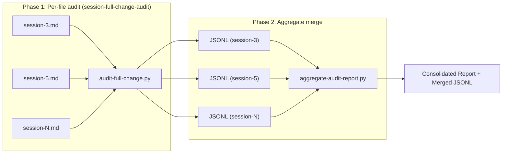

# Session Audit Batch Orchestrator (v1)

> **Skill ID:** `session-audit-batch-orchestrator`
> **Version:** 1.0.0
> **Standard:** [Agent Skills (agentskills.io)](https://agentskills.io)

## Description

Batch-audit multiple opencode session exports into one consolidated,
cross-reference report. This Layer 2 composer orchestrates two phases:

1. **Per-file audit** — delegate to
   [`session-full-change-audit`](../session-full-change-audit/SKILL.md)
   for each session file, capturing JSONL output with a `_session` tag
   derived from the filename stem.
2. **Aggregate merge** — deduplicate files touched across sessions,
   produce per-file cross-reference tables (which sessions touched which
   file), and generate summary statistics.

Supports two input modes:

| Mode | Flag | Description |
|------|------|-------------|
| Live | `--session-dir` | Directory of session `.md` export files; runs `audit-full-change.py` on each |
| Merge | `--jsonl-dir` | Pre-existing JSONL files (produced by earlier `session-full-change-audit` runs) |

**Use this when** you need to answer: *"What did the agent do across N
session exports?"* — with per-file session traceability and aggregate
totals.

**Contrast with** `session-full-change-audit` which handles exactly ONE
session file per invocation. This skill adds the multi-file aggregation
and cross-reference layer.

## Composition Rationale

This skill is a Layer 2 composer: it does NOT re-implement any base
extraction, classification, or single-file audit logic. It orchestrates:

1. [`session-full-change-audit`](../session-full-change-audit/SKILL.md)
   — the per-file audit engine. The batch orchestrator shells out to
   `scripts/audit-full-change.py --session <path>` for each session file,
   captures stdout JSONL, and tags each record with `_session:
   <filename-stem>`.

2. Native JSONL merge and deduplication — the aggregator groups records
   by `filePath` (for writes/edits) or `target` (for deletes), collects
   session provenance per file, and produces the cross-reference table
   format.

The composer's value-add over running `session-full-change-audit`
manually per file: a single CLI that produces a unified report with
session-matrix traceability, eliminating manual shell-looping and
JSONL concatenation.

Bidirectional discoverability: `session-full-change-audit` lists this
composer in its `## Related Skills` / `## Cross-References` section.

## Environment & Dependencies

| Requirement | Minimum | Verification |
|---|---|---|
| Python | 3.12+ | `python3 --version` |
| `session-full-change-audit` | 1.0.0 | Script found at resolved path |

## Operational Logic

### Input

+ **Session file directory** (mode 1): Path to a directory containing
  opencode session export files (`.md` format). Each file is run through
  `session-full-change-audit`.
+ **JSONL directory** (mode 2): Path to a directory containing pre-existing
  JSONL files from earlier `audit-full-change.py --output-jsonl` runs.
  Session name is derived from each JSONL filename stem.

### Output

+ **Merged JSONL** (`--output-jsonl`): Every change record with `_source`
  and `_session` tags, ready for downstream tooling.
+ **Consolidated report** (`--output-report`): Human-readable aggregate
  report with cross-reference section (Write Changes — Files Created,
  Edit Changes — Files Modified, Bash Delete Operations, Bash Other).

### CLI Contract

```bash
# Mode 1: live audit of session files
python3 scripts/aggregate-audit-report.py \
    --session-dir <dir> \
    [--glob *.md] \
    [--output-report <path>] \
    [--output-jsonl <path>]

# Mode 2: merge pre-existing JSONL
python3 scripts/aggregate-audit-report.py \
    --jsonl-dir <dir> \
    [--glob *.jsonl] \
    [--output-report <path>] \
    [--output-jsonl <path>]
```

| Flag | Required | Description |
|---|---|---|
| `--session-dir` | Yes\* | Directory of session `.md` export files (mutually exclusive with `--jsonl-dir`) |
| `--jsonl-dir` | Yes\* | Directory of pre-existing `.jsonl` files (mutually exclusive with `--session-dir`) |
| `--glob` | No | Glob pattern (default: `*.md` for session-dir, `*.jsonl` for jsonl-dir) |
| `--output-report` | No | Write consolidated report to file |
| `--output-jsonl` | No | Write merged JSONL stream to file |

\* Exactly one of `--session-dir` or `--jsonl-dir` is required.

### Exit Codes

| Code | Meaning |
|---|---|
| 0 | Success — changes found |
| 1 | No changes found across any session |
| 2 | Dependency script not found or pipeline failure |
| 3 | Input directory not found |

### Workflow Diagram



### Multi-Phase Workflow

The batch orchestrator supports incremental workflows:

**Example: two-phase audit (as used during development):**

```bash
# Phase 1: audit initial files (3, 5-15)
python3 scripts/aggregate-audit-report.py \
    --session-dir sessions/ \
    --glob "session-{3,5,6,7,8,9,10,11,12,13,14,15}.md" \
    --output-jsonl /tmp/phase1.jsonl \
    --output-report /tmp/phase1-report.md

# Phase 2: audit incremental files (16-18)
python3 scripts/aggregate-audit-report.py \
    --session-dir sessions/ \
    --glob "session-{16,17,18}.md" \
    --output-jsonl /tmp/phase2.jsonl \
    --output-report /tmp/phase2-report.md

# Merge both phases
cat /tmp/phase1.jsonl /tmp/phase2.jsonl > /tmp/merged.jsonl
python3 scripts/aggregate-audit-report.py \
    --jsonl-dir /tmp/ \
    --glob "merged.jsonl" \
    --output-report /tmp/consolidated-report.md
```

### Fresh Full Run Workflow

The batch orchestrator also supports a simpler single-pass workflow that
audits ALL sessions in one invocation, discarding any previous partial
JSONL:

**When to use:** All session files are available simultaneously,
simplicity is preferred over incremental artifacts, and you want a
single self-consistent report.

**Example: fresh full run of non-contiguous sessions:**

```bash
python3 scripts/aggregate-audit-report.py \
    --session-dir sessions/ \
    --glob "session-{3,5,6,7,8,9,10,11,12,13,14,15,16,17,18,19,20,21,22}.md" \
    --output-report scratch/complete-session-audit.md
```

The aggregator internally runs
`audit-full-change.py --output-jsonl <tempfile>` per file, reads the
JSONL, tags with `_session`, and produces a unified report in a single
pass. No intermediate files are kept.

### Decision Guidance: Merge vs Fresh Full Run

| Criteria | Merge Workflow | Fresh Full Run |
|---|---|---|
| Sessions arrive in batches | Yes | No (all available) |
| Want to keep per-phase artifacts | Yes | No |
| Simplicity preferred | No | Yes |
| Non-contiguous session numbering | Works (per-phase) | Works (single glob) |
| Pipeline reliability | More moving parts | Single CLI call |

## Scripts

+ [`scripts/aggregate-audit-report.py`](scripts/aggregate-audit-report.py)
  — Tier-1 Python CLI

## Composition by Lower-Level Skills

| Skill | Composition Mechanism |
|---|---|
| [`session-full-change-audit`](../session-full-change-audit/SKILL.md) | Shells out to `scripts/audit-full-change.py --session <path> --output-jsonl <tempfile>` per file; reads JSONL from tempfile, tags with `_session`, merges |

## Related Skills

+ [`session-file-ops-audit`](../session-file-ops-audit/SKILL.md) —
  Predecessor composer covering bash file operations only
+ [`file-recovery-from-session`](../file-recovery-from-session/SKILL.md) —
  Uses write + bash-write extractors for actual file recovery
+ [`edit-application-from-session`](../edit-application-from-session/SKILL.md) —
  Uses edit extractor for replaying edits onto disk

## Traceability

+ Origin: Session `ses_0dd374af6ffe02JHq06EQ89B48` — batch-aggregation
  layer extracted from the two-phase workflow (files 3, 5–15 → Phase 1;
  files 16–18 → Phase 2; then merge)
+ Bugfix: `collect_from_sessions()` originally parsed stdout as JSONL
  (`audit-full-change.py` outputs human-readable report to stdout, not
  JSONL). Fixed via `tempfile.NamedTemporaryFile` + `--output-jsonl`.
  Confirmed during live 19-session run 2026-07-04.
+ Fresh full run workflow: Single-pass `--session-dir` pattern discovered
  and used during live 19-session audit (sessions 3, 5–22). Simpler
  alternative to the merge-based two-phase workflow.
+ Created 2026-07-04

## License

Internal use — OleoVista Aceros workspace.
