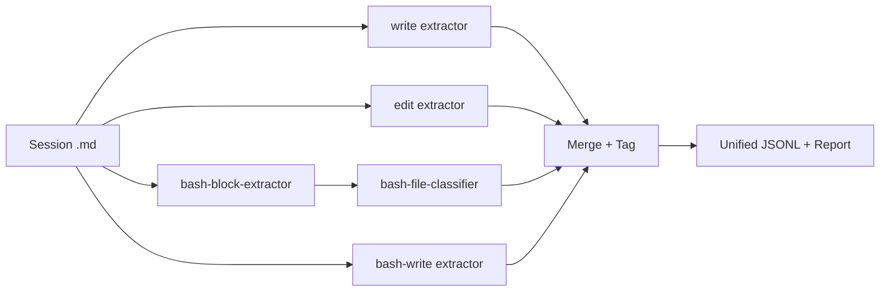

# Session Full Change Audit (v1)

> **Skill ID:** `session-full-change-audit`
> **Version:** 1.0.0
> **Standard:** [Agent Skills (agentskills.io)](https://agentskills.io)

## Description

Audit ALL changes recorded in an opencode session export — every write,
edit, bash heredoc, and bash file operation — producing a unified,
mergeable JSONL stream plus a consolidated human-readable report.

This Layer 3+ composer orchestrates four change-extraction pipelines:

| # | Source | Pipeline |
|---|--------|----------|
| 1 | `Tool: write` | `opencode-session-write-extractor` (single script) |
| 2 | `Tool: edit` | `opencode-session-edit-extractor` (single script) |
| 3 | Tool: bash file ops | `opencode-session-bash-block-extractor` → `opencode-session-bash-file-ops-classifier` (2-stage) |
| 4 | Tool: bash heredoc writes | `opencode-session-bash-write-extractor` (single script) |

**Use this when** you need a comprehensive answer to the question:
*"What did the agent do during this session?"* — covering every change
type, not just bash file operations.

**Contrast with** `session-file-ops-audit` which covers bash file
operations only. This skill covers all four change sources and produces
a mergeable JSONL stream with a `_source` discriminator field.

## Composition Rationale

This skill is a Layer 3+ composer: it does NOT re-implement any base
extraction or classification logic. It orchestrates four base skills:

1. [`opencode-session-write-extractor`](../opencode-session-write-extractor/SKILL.md)
   — invoked for Tool: write payloads. The composer shells out to
   `scripts/extract-session-writes.py --session <path>` and tags every
   payload with `_source: "write"`.
2. [`opencode-session-edit-extractor`](../opencode-session-edit-extractor/SKILL.md)
   — invoked for Tool: edit payloads. The composer shells out to
   `scripts/extract-session-edits.py --session <path>` and tags every
   payload with `_source: "edit"`.
3. [`opencode-session-bash-block-extractor`](../opencode-session-bash-block-extractor/SKILL.md)
   + [`opencode-session-bash-file-ops-classifier`](../opencode-session-bash-file-ops-classifier/SKILL.md)
   — the standard 2-stage bash pipeline. The composer runs extractor
   first, pipes stdout to classifier, and tags results with
   `_source: "bash-op"`.
4. [`opencode-session-bash-write-extractor`](../opencode-session-bash-write-extractor/SKILL.md)
   — invoked for Tool: bash heredoc writes. The composer shells out to
   `scripts/extract-bash-writes.py --session <path>` and tags every
   payload with `_source: "bash-write"`.

The composer's domain-specific value-add over any base alone: a single
CLI that merges all change types into one ordered JSONL stream with
source-typed discrimination, so downstream consumers (reporting,
statistics, CI) process one stream instead of four.

Bidirectional discoverability: all four base skills list this composer
in their `## Composition by Higher-Level Skills` tables.

## Environment & Dependencies

| Requirement | Minimum | Verification |
|---|---|---|
| Python | 3.12+ | `python3 --version` |
| `opencode-session-write-extractor` | 1.0.0 | Script found at resolved path |
| `opencode-session-edit-extractor` | 1.0.0 | Script found at resolved path |
| `opencode-session-bash-block-extractor` | 1.0.0 | Script found at resolved path |
| `opencode-session-bash-file-ops-classifier` | 1.0.0 | Script found at resolved path |
| `opencode-session-bash-write-extractor` | 1.0.0 | Script found at resolved path |

## Operational Logic

### Input

+ **Session file**: Path to opencode session export (`.md` format)
+ **Optional filter**: `--source` to limit to specific source types

### Pipeline



### CLI Contract

```bash
python3 scripts/audit-full-change.py --session <path> \
    [--source write|edit|bash|bash-write|all] \
    [--output-jsonl <path>] \
    [--output-report <path>]
```

| Flag | Required | Description |
|---|---|---|
| `--session` | Yes | Path to opencode session export (.md) |
| `--source` | No | Filter: write, edit, bash, bash-write, all (default: all) |
| `--output-jsonl` | No | Write unified JSONL stream to file (NOT stdout). JSONL is never sent to stdout — downstream consumers (e.g. `session-audit-batch-orchestrator`) MUST use this flag. |
| `--output-report` | No | Write human-readable report to file (in addition to stdout). The report always prints to stdout regardless of this flag. |

### Exit Codes

| Code | Meaning |
|---|---|
| 0 | Success — at least one change found |
| 1 | No changes found |
| 2 | Dependency script not found or pipeline failure |
| 3 | Session file not found |

## Scripts

+ [`scripts/audit-full-change.py`](scripts/audit-full-change.py) —
  Tier-1 Python CLI

## Composition by Lower-Level Skills

| Skill | Composition Mechanism |
|---|---|
| [`opencode-session-write-extractor`](../opencode-session-write-extractor/SKILL.md) | Invokes `scripts/extract-session-writes.py`, pipes stdout to JSONL merge; consumes `filePath` + `content` fields, tags with `_source: "write"` |
| [`opencode-session-edit-extractor`](../opencode-session-edit-extractor/SKILL.md) | Invokes `scripts/extract-session-edits.py`, pipes stdout to JSONL merge; consumes `filePath` + `oldString` + `newString`, tags with `_source: "edit"` |
| [`opencode-session-bash-block-extractor`](../opencode-session-bash-block-extractor/SKILL.md) + [`opencode-session-bash-file-ops-classifier`](../opencode-session-bash-file-ops-classifier/SKILL.md) | Runs 2-stage pipeline (extract → classify), pipes stdout to JSONL merge; consumes `command` + `operation` + `target` + `source`, tags with `_source: "bash-op"` |
| [`opencode-session-bash-write-extractor`](../opencode-session-bash-write-extractor/SKILL.md) | Invokes `scripts/extract-bash-writes.py`, pipes stdout to JSONL merge; consumes `filePath` + `content`, tags with `_source: "bash-write"` |

## Related Skills

+ [`session-file-ops-audit`](../session-file-ops-audit/SKILL.md) —
  Predecessor composer covering bash file operations only
+ [`file-recovery-from-session`](../file-recovery-from-session/SKILL.md) —
  Uses write + bash-write extractors for actual file recovery
+ [`edit-application-from-session`](../edit-application-from-session/SKILL.md) —
  Uses edit extractor for replaying edits onto disk

## Traceability

+ Origin: Session `ses_0dd374af6ffe02JHq06EQ89B48` — Layer 3+ composer
  extending the 3-layer architecture to cover all change types
+ Created 2026-07-04

## License

Internal use — OleoVista Aceros workspace.
